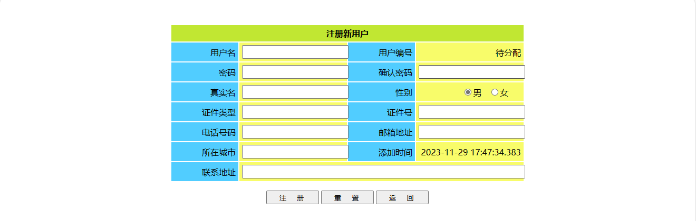
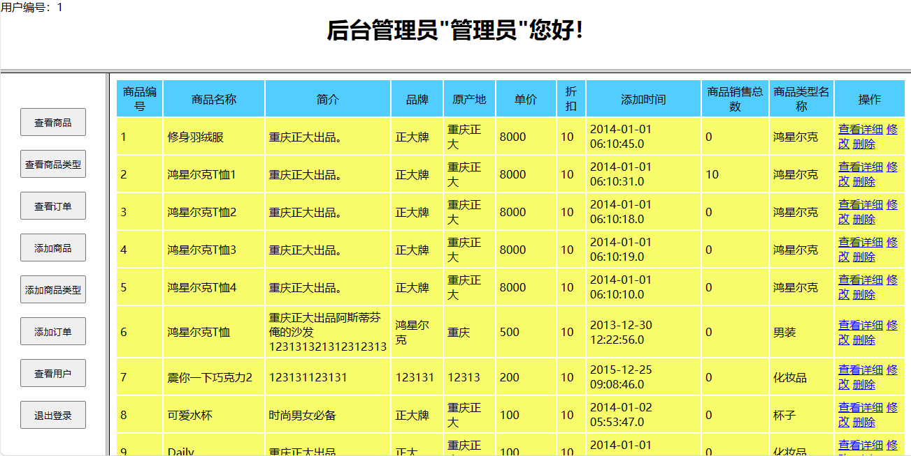
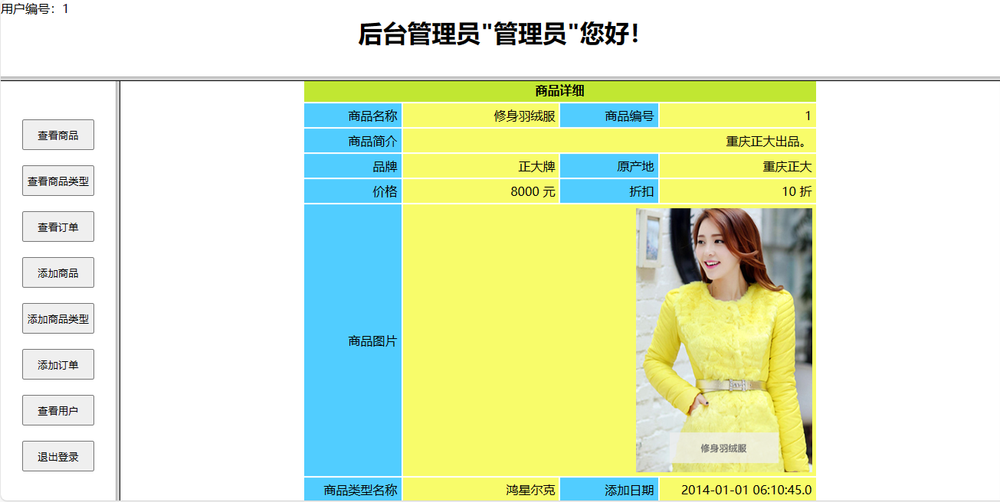
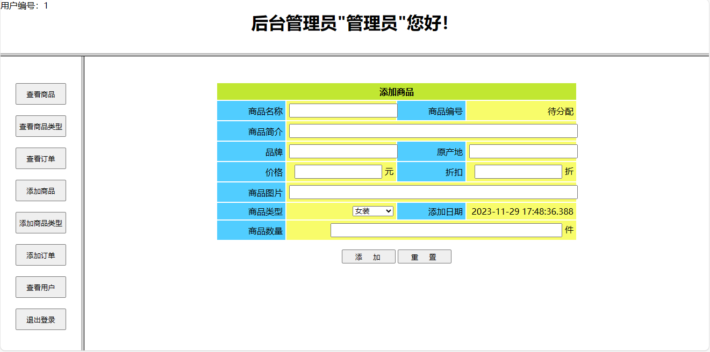
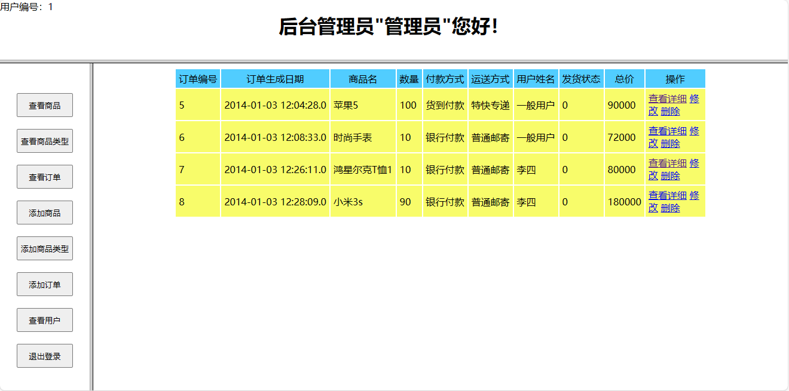
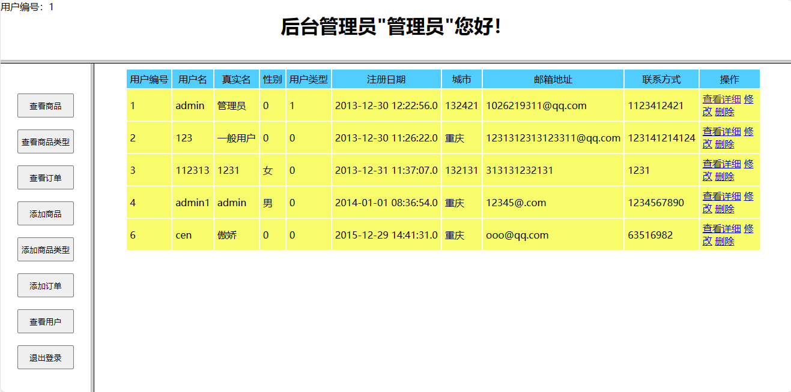

<h1 align="center">37.基于sevlet+jsp的网上商城管理系统</h1>

- <b>完整代码获取地址：从戎源码网 ([https://armycodes.com/](https://armycodes.com/))</b>
- <b>技术探讨、资料分享，请加QQ群：692619798</b> 
- <b>作者微信：19941326836  QQ：952045282</b> 
- <b>承接计算机毕业设计、Java毕业设计、Python毕业设计、深度学习、机器学习</b>
- <b>选题+开题报告+任务书+程序定制+安装调试+论文+答辩ppt 一条龙服务</b>
- <b>所有选题地址 ([https://github.com/YuLin-Coder/AllProjectCatalog](https://github.com/YuLin-Coder/AllProjectCatalog)) </b>

## 环境

- <b>IntelliJ IDEA 2009.3</b>

- <b>Mysql 5.7.26</b>

- <b>Tomcat 7.0.73</b>

- <b>JDK 1.8</b>

## 简介
基于sevlet+jsp的网上商城管理系统：运行在Tomcat 7.0的web工程，前台用了jsp、js、css等技术，后台用了Servlet作控制器调用java类来进行业务处理，MySQL后台数据库。

大学期末实训项目。

亮点

1. 从高层架构至底层细节的编码思路和方法，从底层数据库到实体类、逻辑类再到控制层最后到表层页面的设计编码顺序。
2. 边开发边测试的开发过程实践。
3. 整合多个Servlet调用，使用传入操作参数operate实现区别调用业务逻辑。
4. 从数据库中按需地有限地取出需要数据，以保证数据的安全性。

## 功能说明

1. #### 注册
	1. 点击登录页面下方的“注册”按钮进入注册页面。
	2. 注册页面包括：用户名、用户编号（待分配）、密码、确认密码（需与密码一直）、真实名、性别、证件类型、证件号、电话号码、邮箱地址、所在城市、添加时间（自动生成）、联系地址。
	3. 填写完毕之后，点击下方“注册”按钮提交填写资料；“重置”按钮清空填写。
	4. 经过后台处理，若填写的资料合法则录入保存数据库，并返回成功提示（包括注册的用户名跟用户编号）同时跳转到登录页面；否则，弹出错误提示并刷新注册页面。
2. #### 登录
	1. 登录页面是本站入口
	2. 填写用户名、密码之后点击“提交”按钮提交登录信息；“重置”按钮清空填写。
	3. 经过后台处理，若登录的用户名跟密码均存在，则提示登录成功同时跳转到网站主页面；若用户名不存在，则提示用户名错误同时刷新登录页面；若存在用户名却不是相应的密码，则提示密码错误同时刷新登录页面。
3. #### 网站主页面
	1. 登录成功进入主页面：
		1. 上方，登录的用户信息：用户编号、用户类型、真实姓名
		2. 左边，菜单栏：点击按钮在右边内容框架显示相应内容，根据用户类型不同显示按钮不同。
		3. 右边，内容页：默认显示欢迎页，通过点击菜单栏按钮来改变进入的页面。
	2. 菜单栏项目：
		1. 一般用户：查看商品、查看商品类型、查看订单、退出登录
		2. 管理员：查看商品、查看商品类型、查看订单、添加商品、添加商品类型、添加订单、查看用户、退出登录

4. #### 查看商品
	1. 点击菜单栏“查看商品”按钮在内容框架现实所有商品查询结果。
	2. 商品查询结果包括：商品编号、商品名称、简介、品牌、原产地、单价、折扣、添加时间、商品销售总数、商品类型名称、操作。
	3. 通过“操作”栏下 查看详细、修改、删除 三个超链接可实现删、改、查等功能。
	4. 查看详细：点击“查看详细”链接，进入商品详细页面，显示包括：商品名称、商品编号、商品简介、品牌、原产地、价格、折扣、商品图片、商品类型名称、添加日期、商品数量。其中，商品图片以图片方式显示。
	5. 修改：点击“修改”链接，进入商品修改页面，可修改包括：商品名称、商品简介、品牌、原产地、价格、折扣、商品图片、商品类型、商品数量。商品编号无法更改，添加日期自动生成。商品类型则为下拉选框。
	6.  删除：点击“删除”链接，删除此条商品信息。若删除成功，则弹出成功提示。

5. #### 添加商品
	1. 点击菜单栏“添加商品”按钮，在内容框架打开添加商品页面。
	2. 添加商品需填写项目包括：商品名称、商品简介、品牌、原产地、价格、折扣、商品图片、商品类型名称、商品数量。商品类型为下拉选框，添加日期为自动生成。若添加成功，则弹出提示显示该商品被分配到的id。

6. #### 退出登录
	1. 点击菜单栏“退出登录”按钮返回登录页面，并同时销毁当前session。

## 心得总结
### 实训收获
这次期末实训的项目是在线商城系统。在制作商城系统的过程中，我把重心放在了后台servlet、实体和逻辑类的构建编码上。实体类用数据类型进行封装，极大的简化了参数的数据结构和传值效率；一个servlet通过operate（操作）参数判断当前提交操作，合并了同一实体的多个servlet，极大简化了代码增强了可读性；在dao的逻辑处理类中，通过调用DBHandle（数据库操作类），把复杂的逻辑过程用方法封装，隐蔽了内部逻辑，调用时更简洁明了。

除了后台，前端编写方面，我也参照了各个网站比较常见的写法。例如，用link标签stylesheet外联css样式表，做到一个css样式多个网页重复利用；css内部的样式的过滤器优先级的使用方法；页面上用javascript获取窗口DOM对象以及实现提交跳转。

### 后台编码的心得
1.	全新的代码构建方式：从底层到顶层（数据库→数据库操作类→实体类→逻辑类→servlet处理类→前台网页）。
2.	重构架大于重功能：一开始先统一创建好每一个操作层面的包与其中的类，再之后的编程中有着更清晰的调用思路。增强了代码的可维护性。
3.	comm包的使用：在servlet、实体、逻辑层面之外，建立comm通用包以存放通用类。除了DBHandle这样的底层通用操作之外，servlet里也有大量的重复处理操作（例如设置字体，清除过期的session属性等）。我把这些相同操作抽象封装到comm.ServletDeal类中的静态方法，极大的隐蔽了代码细节，在servlet之中只需关系传入传出的调用结果即可。
4.	编码过程中的测试：comm包中专门建立了测试类Dome，以便在后台编码的过程中针对每一个方法能够编写测试用例（尽管没有用Junit而是用的main方法加输出）。达到边开发边测试的编码效果，有bug能及时发现，极大的减少了单个环节出错的概率。
5.	插入新的条目之后返回id：插入数据库成功，数据库会自动分配id。add方法如果返回的是此id则更加符合需求，于是把插入成功条目数改成新插入条目的id。

###	前台编码的心得
1.	css外联样式表的使用：在webcontent网站根目录文件里专门建立CSS文件夹，统一放置外联样式文件，方便整理调用。
2.	css样式表里选择器的语法及其优先级：id>标签+属性+值>class>标签+属性>标签；class之内的标签可以通过最上级class获取等等。
3.	使用javascript的DOM对象：获取名为“content”的窗口："var win=top.frams['content'];"。在目标窗口内实现页面跳转：" win.location.href="./login.jsp" "。
4.	页面session的使用与销毁：例如在登录界面检查是否存在登录的session属性"loginUserinfo"，若存在，则用invalidate()方法销毁当前session。

###	不足
1.	合法性检测及防卫性编程：页面输入在提交之前应有javascript检测输入合法性，若输入不合法则应在提交servlet之前阻止提交，以减少资源的消耗。同时对于各种可能的误操作及误输入没有有效的阻挡和提示。
2.	严格的安全性：例如在用户登录时储存在session中的用户信息，不应包括密码；若操作需要验证密码，则应提交到数据库重新请求验证。
3.	按钮化和文件传输：用户信息的填写，商品图片的提交，这种有严格规定的数据，应该通过按钮式操作自动化处理，而非用户自行输入填写。唯有如此才能减少错误发生，提高系统便利性。
4.	页面布局：采用frameset+table而非div，页面布局不够灵活，审美性不足。

**总结**：编码的前期设计是非常重要的，代码在编写过程中的简洁、抽象、模块化、标准化都大大有助于代码的读取、编写和维护。

### 自我认识

通过这次项目实训的学习，我发现自己在项目构建的前期设计准备方面仍然有所欠缺，这种欠缺在这次的实训中有了深刻的认识。经过老师的一番点播，我意识到了软件工程对于实际编写代码的重要性。然后在编码的抽象化上，我尽量尝试了模块化抽象化的编写方法，并且注重代码的可读性。但我仍觉做得并不好，究其原因还是对项目的整个开发流程缺乏认识和经验。在以后的学习生活中，还应该更加努力，多多练习。

## 更新日志
撰写说明文档，上传已完成的在线商城系统项目。

## 运行截图

